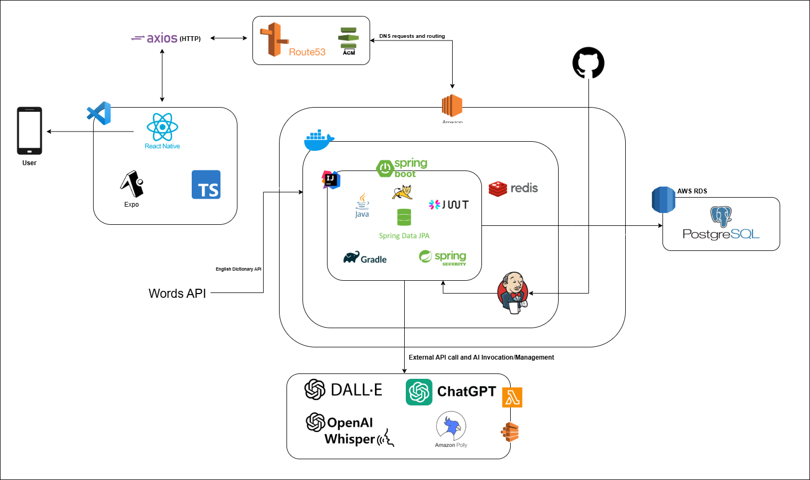

# StoryCraft - AI 영어 동화 학습 앱 (Backend)

> 2025 ICT 한이음 드림업 프로젝트  
> AI 개인화 동화 기반 영어 학습 서비스 (Backend API Server)
>
> ※ 본 저장소는 팀 협업 프로젝트의 포트폴리오 공개용 Fork입니다.  
> ※ 본 문서는 백엔드 담당자로서의 기여 및 기술 경험 중심으로 정리되었습니다.


## 🎬 시연 영상
- 데모 영상: [StoryCraft 시연 영상](https://www.youtube.com/watch?v=xxvvHqhwsYw) 🎥


## 👥 팀 구성

| 역할 | 이름 | 담당 업무 | 소속 |
|------|------|----------|------|
| 멘토 | 송춘광 | 멘토링 | 나이스컨설팅 |
| 팀장 | 임효준 | **백엔드 아키텍처 설계 및 핵심 기능 구현** | 수원대학교 |
| 멘티 | 조예령 | 백엔드 개발 | 명지대학교 |
| 멘티 | 김성준 | 프론트엔드 개발 | 한국방송통신대학교 |
| 멘티 | 류성민 | 프론트엔드 개발 | 수원대학교 |


## 🎯 프로젝트 개요

StoryCraft는 아이들이 AI가 생성한 영어 동화를  
읽고(Reading) · 듣고(Listening) · 풀며(Quiz) 학습하도록 설계된 모바일 학습 서비스입니다.

백엔드는 동화 생성, 삽화 생성, 퀴즈, 음성(TTS/STT), 통계 등  
서비스 핵심 로직과 AI 연동을 담당합니다.


## 📚 프로젝트 자료
- 설계서: [25년 SW 개발 제작설계서 공모전.pptx](docs/25년_SW개발_제작설계서_공모전.pptx)
- 수행계획서: [2025년 ICT 한이음 드림업 프로젝트 수행계획서\_StoryCraft.pdf](<docs/2025년 ICT 한이음 드림업 프로젝트 수행계획서_StoryCraft.pdf>)
- 결과보고서: [2025년 한이음 드림업 프로젝트 결과보고서\_StoryCraft.pdf](<docs/2025년 한이음 드림업 프로젝트 결과보고서_StoryCraft.pdf>)


## 🔗️ 프론트엔드 저장소

- Frontend Repository: https://github.com/StoryCraft-BackEnd/storycraft-frontend

---

# 👨‍💻 담당한 핵심 기여 (Backend)

## 🏗 아키텍처 및 도메인 설계
- Spring Boot 기반 RESTful API 설계
- Story / StorySection / Quiz / Illustration / Speech 모듈 구조 설계
- 엔티티 연관관계 정립 및 JPA 기반 도메인 모델링
- Swagger(OpenAPI) 문서화 및 테스트 환경 구성

## 🤖 AI 연동 구현
- OpenAI LLM 기반 개인화 동화 생성
- 중요 단어 하이라이트(**word**) 처리 및 단어 추출 API
- DALL·E 기반 동화 삽화 생성
- Amazon Polly 기반 TTS 생성 (성우/속도 설정 지원)
- Whisper 기반 STT 연동 (키워드 입력 단계 활용)

## ☁ 인프라 구성
- AWS RDS(PostgreSQL) 구축 및 데이터베이스 설계
- AWS EC2 인스턴스 배포 및 서버 환경 구성
- 애플리케이션 실행 환경 세팅 및 DB 연동
- Docker 기반 배포 구조는 팀원과 협업하여 구성

---

# 🛠 기술 스택

## Backend
- Java 17
- Spring Boot 3.2.5
- Spring Data JPA
- PostgreSQL (AWS RDS)
- Swagger (OpenAPI)

## Infra
- AWS EC2
- AWS RDS
- AWS Route53
- AWS ACM

## External AI Services
- OpenAI (GPT / Whisper)
- Amazon Polly (TTS)
- DALL·E (Image Generation)

---

# ✨ 주요 기능

## 📖 동화 생성
- 키워드 기반 개인화 동화 생성
- 단락(Section) 단위 저장 및 조회
- 중요 단어 자동 하이라이트 및 단어 API 제공

## 🖼️ 삽화 생성
- 동화 장면 기반 이미지 생성
- 스타일 변경 옵션 지원

## 🔊 음성 기능
- 단락 단위 TTS 생성
- 성우 및 말하기 속도 조절
- STT 기반 키워드 입력 지원

## 🎯 퀴즈 시스템
- 동화 기반 자동 객관식 퀴즈 생성
- 점수 저장 및 통계 연동

## 📊 학습 통계
- 학습 시간 집계
- 동화/퀴즈/단어 통계 관리
- 사용자별 학습 데이터 분리

---

# 🧩 아키텍처 개요


- 클라우드: AWS 인프라 사용
    - 도메인/HTTPS: AWS Route53 + ACM을 통한 HTTPS 인증서, DNS 라우팅
    - 데이터베이스: PostgreSQL(AWS RDS) 사용
- 모바일 앱: React Native(Expo) + TypeScript
- 통신: axios 기반 HTTPS API 호출
- 외부 AI 서비스
    - OpenAI(GPT): 동화 생성/문장 생성 등 LLM 활용
    - Amazon Polly: TTS(음성 합성) 사용
    - DALL·E: 동화 삽화 이미지 생성

---

# 🐛 Trouble Shooting (Backend)

## 1️⃣ Swagger Story 생성 500 에러 - ChildProfile 역직렬화 실패

### 문제
- Swagger에서 Story 생성 API 호출 시 500 Internal Server Error 발생
- `"childId": 1` 값이 `ChildProfile` 엔티티로 역직렬화되지 못해 Jackson 예외 발생

### 원인
- Request DTO에서 `ChildProfile` 객체를 직접 받도록 설계
- Jackson이 숫자(Long)를 엔티티 객체로 변환하려다 실패

### 해결
- `StoryRequestDto`의 `ChildProfile` → `Long childId`로 변경
- Service 계층에서 `childProfileRepository.findById(childId)`로 직접 조회 후 주입
- DTO와 Entity 분리 원칙 재확인

### 배운 점
- 요청 DTO에 엔티티를 직접 받는 설계는 위험
- DTO는 식별자만 받고, 엔티티 조회는 Service에서 수행하는 것이 안전

>관련 커밋:
`fix: Story 생성 시 ChildProfile 역직렬화 오류 해결`


## 2️⃣ ApplicationContext 초기화 실패 - JPA Repository 메서드명 오류

### 문제
- Spring Boot 실행 시 ApplicationContext 초기화 단계에서 애플리케이션 구동 실패

### 원인
- JPA Repository 메서드명과 엔티티 필드명이 불일치

#### Case 1 - StorySectionRepository
- `findAllByStoryOrderByOrderIndex(...)`
- 엔티티 필드명이 `storyId`로 되어 있어 `story`를 찾지 못함

#### ✔ 조치:
- `storyId` → `story`로 변경
- `@ManyToOne` 연관관계 명확히 설정

#### Case 2 - StoryPreviewRepository
- `findAllByChildIdOrderAndCreatedAtDesc(...)`
- 잘못된 키워드 조합

#### ✔ 조치:
- `findAllByChildIdOrderByCreatedAtDesc(...)`로 수정

### 배운 점
- JPA 쿼리 메서드는 엔티티 필드명 기준으로 동작
- OrderBy 이후에는 정렬 필드만 와야 함
- Naming 오류는 실행 단계가 아닌 초기화 단계에서 바로 실패할 수 있음

>관련 커밋:
`fix: JPA 메서드명 오타 및 엔티티 필드명 불일치 수정`

---

# 🚀 실행 방법

```bash
./gradlew clean build
java -jar build/libs/storycraft-backend.jar
```